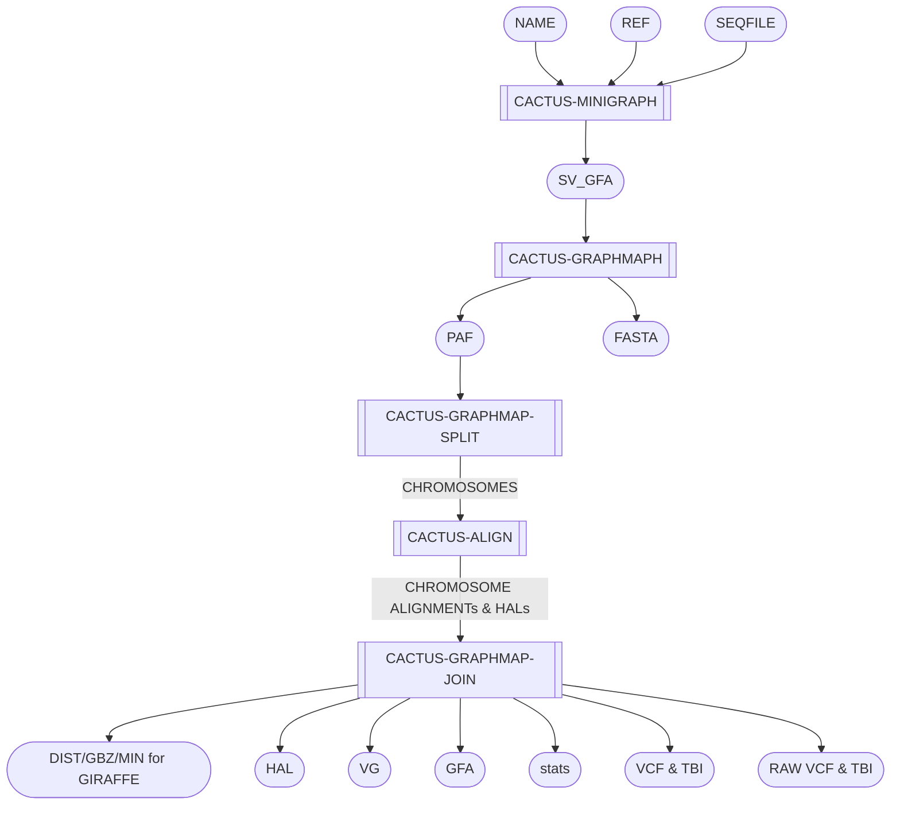

# Minigraph-Cactus Graph Builder - MCGB

Build pangenome graphs with minigraph-cactus.

## Pipeline Chart
*Note: this workflow runs all 5 steps in one task*

## Pipeline Files
* mcgb.wdl          - WDL pipeline
* mcgb.inputs.json  - pipeline inputs with place holders
* mcgb.outputs.yaml - steps and outputs to be copied after pipeline run
* mcgb.imports.zip  - imports used in the WDL
* mcgb.doc.md       - this file, documenting the pipeline

## Inputs
* name [String] - output base name
* ref [String] - the sequence name in the seqfile to as the "reference"
* seqfile [File] - tab sepqarated file of sequence names and URLs (files)
* docker [String] - docker to use
* cpu [Int] - cpus to request
* memory [Int] - memory to request

## Steps
### Map to the Pangenome with VG Giraffe [run_mcgb]
#### input
* name [workflow inputs]
* ref [workflow inputs]
* seqfile [workflow inputs]
#### output
* dist
* fasta
* gaf
* gbz
* gfa
* hal
* min
* paf
* stats
* sv_gfa
* vcf
* vcf_tbi
* raw_vcf
* raw_vcf_tbi
