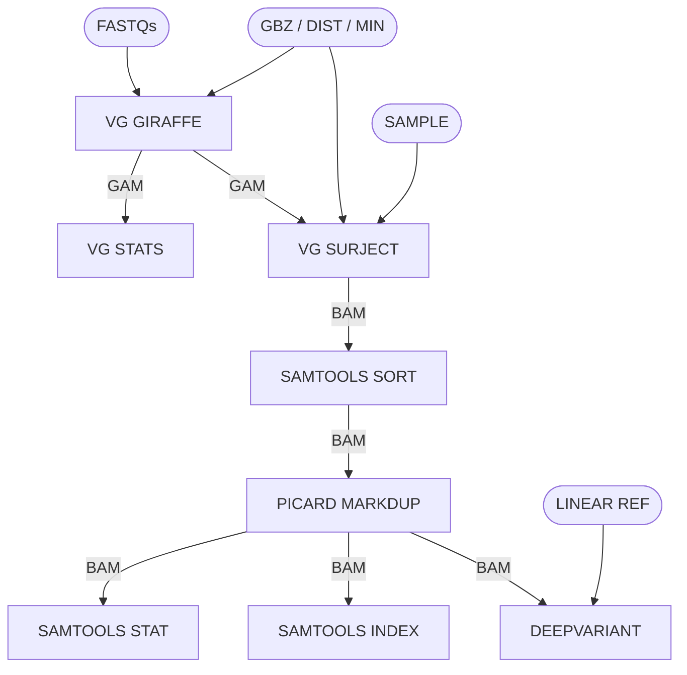

# Pangenome WGS Pipeline

Map WGS data to the pangenome graph using giraffe, and call variants with haplotype caller and deep variant. Produces a GAM, sorted BAM & BAI, plus VCF & stats.

## Pipeline Chart

## Pipeline Files
* wgs.wdl          - WDL pipeline
* wgs.inputs.json  - pipeline inputs with place holders
* wgs.outputs.yaml - steps and outputs to be copied after pipeline run
* wgs.imports.zip  - imports used in the WDL
* wgs.doc.md       - this file, documenting the pipeline

## Inputs
* sample [String] - sample name for outputs
* fastqs [File] - an array of read1 and read2 fastqs
* gbz [File] - giraffe pangenome GBZ
* dist - pangenome dist
* min - pangenome mxoin
* reference - linear reference path with FAI and DICT

## Steps
### Map to the Pangenome with VG Giraffe
#### input
* sample [workflow inputs]
* fastqs [workflow inputs]
* gbz [workflow inputs]
* dist [workflow inputs]
* min [workflow inputs]
####output:
* gam

### VG Stats
#### input
* gam [from run_giraffe]
####output:
* stats

### VG Surject GAM to BAM
#### input
* gam [from run_giraffe]
#### output
* bam

### Samtools Sort BAM by Coordinates
The bam needs to be sorted by coordinate to call variants
#### input
* bam [from surject]
#### output
* sorted_bam

### Samtools Stat
#### input
* bam [from surject]
#### output
* stats [samtools stat file]

### Samtools Index
Deep variant and other tools require a BAI
#### input
* bam [from surject]
#### output
* bai [bam index file]

### Deep Variant
* bam [from surject]
* reference [workflow input]
#### output
* vcf

## Outputs
* gam [from run_giraffe]
* gam_stats [from run_stats]
* bam [from samtools_sort]
* bai [from samtools_index]
* bam_stats [from samtools_stat]
* vcf [from deep variant]
* dedup_metrics [from markdup]
* stats [from stats]
