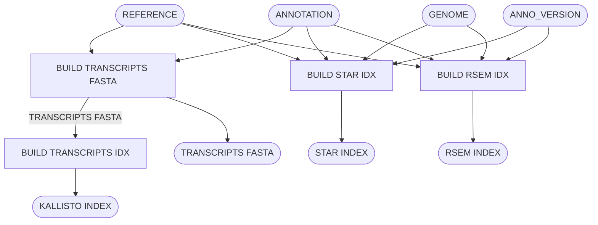

# Build Indexes for Bulk RNA Pipeline

Build STAR, RSEM, & KALLISTO indexes for the bulk RNA pipeline.

## Pipeline Chart

## Pipeline Files
* build-idx.wdl - WDL pipeline
* build-idx.inputs.json - pipeline inputs with place holders
* build-idx.outputs.yaml - steps and outputs to be copied after pipeline run
* build-idx.imports.zip - imports used in the WDL
* build-idx.doc.md - this file, documenting the pipeline

## Inputs
* reference [File] - sequences FASTA GZ
* annotation [File] - annotations GTF GZ
* genome [String] - genome name (GRCh38)
* anno_version - annotation version (gencode_v36)

## Steps
### Build Transcripts FASTA [build_transripts_fasta]
#### input
* reference [inputs.reference]
* annotation [inputs.annotation]
#### output
* transcripts [File] - transcript sequences FASTA

## Build Transcripts (Kallisto) Index [build_transcripts_index]
####input
* reference [build_transcripts_fasta.transcripts]
####output
* index [File] - kallisto index

### Build STAR Index [build_star_index]
#### input
* reference [inputs.reference]
* annotation [inputs.annotation]
* genome [inputs.genome]
* anno_version [inputs.anno_version]
#### output
* index [File] - TAR with STAR index plus support files

### Build RSEM Index [build_rsem_index]
#### input
* reference [inputs.reference]
* annotation [inputs.annotation]
* genome [inputs.genome]
* anno_version [inputs.anno_version]
#### output
* index - RSEM index

## Outputs
* kallisto_index [build_transcripts_index.index]
* rsem_index [build_rsem_index.index]
* star_index [build_star_index.index]
* trancripts [build_transcripts.transcripts]
