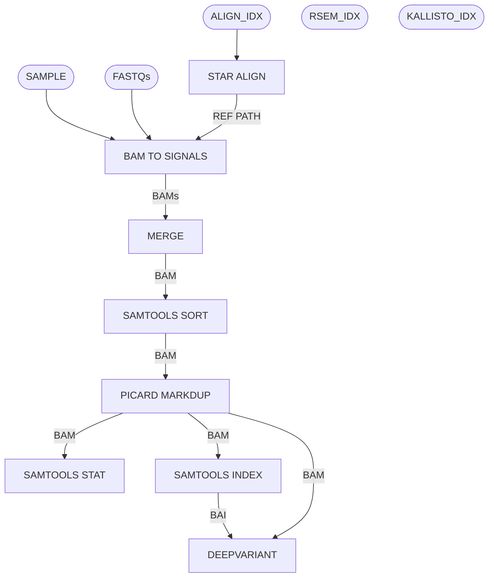

# Bulk RNA Pipeline

Map Bulk RNA fastqs using STAR and run analysis tools stringtie, rsem, kallisto, etc. This is the MGI Wang Lab standard for processing bulk RNA data.

## Pipeline Chart

## Pipeline Files
* bulk.wdl - WDL pipeline
* bulk.inputs.json - pipeline inputs with place holders
* bulk.outputs.yaml - steps and outputs to be copied after pipeline run
* bulk.imports.zip - imports used in the WDL
* bulk.docs.md - this file, documenting the pipeline

## Inputs (General, see WDL/inputs files for more)
* bamroot [String] - base name for outputs
* fastqs [File] - an array of an 2 arrays, one each for read1 and read2 fastqs
* endedness [String] - 
* strandedness [String] - 
* strandedness_direction [String] - 
* annotation [File] - 
* chrom_sizes [File] - TSV or chromsome names and lengths 
* align_idx [File] - tarred STAR index (made from build-idx pipeline)
* kallisto_idx [File] - kallisto index (made from build-idx pipeline)
* rsem_idx [File] - tarred RSEM index (made from build-idx pipeline)
* rna_qc_tr_id_to_gene_type_tsv - TSV of gene ids and their type

## Steps
### Align with STAR
#### input
* fastqs_R1 [inputs.fastqs_R1]
* fastqs_R2 [inputs.fastqs_R2]
* index [inputs.align_idx]
* endedness [inputs.endedness]
* bamroot [inputs.bamroot]
#### output
* genomebam - STAR genome BAM
* annobam - STAR transctiptome alignment BAM
* splice_juntions [splice junctions TSV]
* genome_flagstat [genome BAM flagstat]
* genome_flagstat_json [genome BAM flagstat as JSON]
* anno_flagstat [annotation BAM flagstat]
* anno_flagstat_json [anotation BAM flagstat as JSON]
* log [STAR log]
* log_json [STAR log as JSON]
* python_log [python script log]

### BAM Check - Genome & Anno
#### inputs
* bam [align.genomebam/align.annobam]
#### output
NONE

### BAM to Signals
#### inputs
* input_bam [align.genomebam]
* chrom_sizes [inputs.chrom_sizes]
* strandedness [inputs.strandedness]
* bamroot [inputs.bamroot]
#### output (strandedness dependent)
* unique_unstranded [bigwig file of signals]
* all_unstranded [bigwig file of signals]
* unique_plus [bigwig file of signals]
* unique_minus [bigwig file of signals]
* all_plus [bigwig file of signals]
* all_minus [bigwig file of signals]
* python_log [script log]

#### RSEM Quant
#### input
* rsem_index [inputs.rsem_index,
* rnd_seed [inputs.rnd_seed (12345)]
* anno_bam [align.annobam]
* endedness [inputs.endedness]
* read_strand [inputs.strandedness_direction,
#### output
* genes_results []
* isoforms_results[]
* python_log []
* number_of_genes []

### STRINGTIE
#### input
* sample [inputs.bamroot]
* bam [align.genomebam]
* annotation [inputs.annotation]
#### output
* denovo_transcipts []
* abundance_estimate []

### Kallisto
==== input
* fastqs_R1 [inputs.fastqs_R1]
* fastqs_R2 [inputs.fastqs_R2]
* endedness [inputs.endedness]
* strandedness_direction [inputs.strandedness_direction,
* kallisto_index [inputs.kallisto_idx]
* fragment_length
* sd_of_fragment_length
* out_prefix [inputs.bamroot]
#### output
* quants [RSEM abundance]
* python_log [python log]

### MAD QC (if 2 replicates)
#### input
* quants1 [rsem_quant.genes_results[0]]
* quants2 [rsem_quant.genes_results[1]]
#### output
* madQCplot
* madQCmetrics
* python_log [script log]

### RNA QC
#### input
* input_bam [align.annobam]
* tr_id_to_gene_type_tsv [inpuits.rna_qc_tr_id_to_gene_type_tsv]
* output_filename [inputs.bamroot]
#### output
* rnaQC
* python_log [script log]

## Outputs
