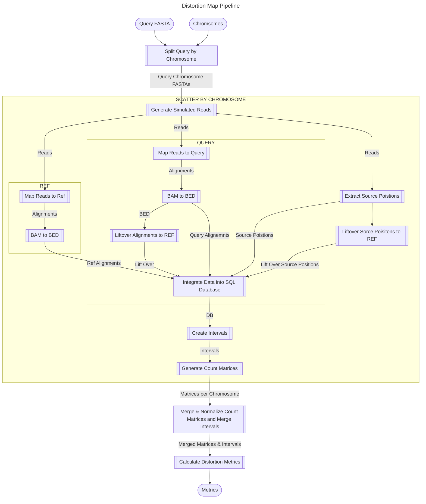

# Distortion Map Pipeline

## Pipeline Chart

```mermaid
---
title: Distortion Map Pipeline
---
flowchart TB;
  i1([Query FASTA]);
  i2([Chromsomes]);

  s1[[Split Query by Chromosome]];
  s21[[Generate Simulated Reads]];
  s22[[Extract Source Poistions]];
  s23[[Liftover Sorce Poisitons to REF]];

  s31[[Map Reads to Ref]];
  s32[[BAM to BED]];

  s41[[Map Reads to Query]];
  s42[[BAM to BED]];
  s43[[Liftover Alignments to REF]];

  s61[[Integrate Data into SQL Database]];
  s62[[Create Intervals]]
  s63[[Generate Count Matrices]];

  s101[[Merge & Normalize Count Matrices and Merge Intervals]];
  s102[[Calculate Distortion Metrics]];

  o1([Metrics]);
 
  i1-->s1; i2-->s1;
  s1--Query Chromosome FASTAs-->s21;
  subgraph sg1 ["SCATTER BY CHROMOSOME"]
    s21--Reads-->s31;
    s21--Reads-->s41;
    s21--Reads-->s22-->s23--Lift Over Source Positions-->s61;
    s22--Source Poistions-->s61
    subgraph sgq ["REF"]
      s31--Alignments-->s32
    end
    subgraph sgr ["QUERY"]
      s41--Alignments-->s42--BED-->s43
      s42--Query Alignemnts-->s61;
    end
    s32--Ref Alignments-->s61;
    s43--Lift Over-->s61;
    s61--DB-->s62--Intervals-->s63;
  end
  s63--Matrices per Chromosome-->s101--Merged Matrices & Intervals-->s102

  s102-->o1
```
