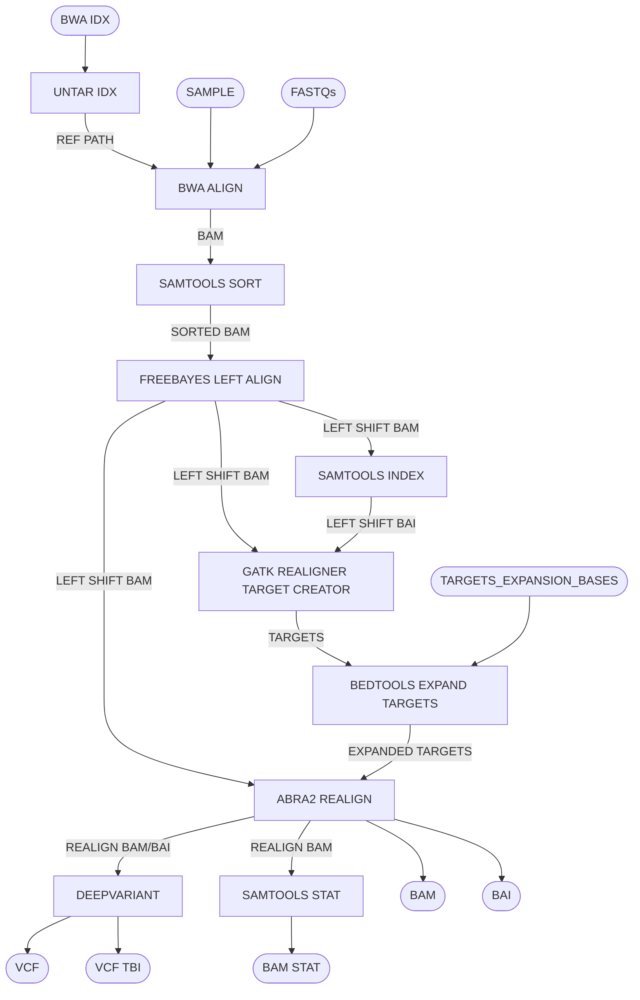

# Pangenome WGS Pipeline

Map WGS data to the linear geome with BWA, optionally left shift/realign bam, and call variants with deep variant. Produces sorted BAM w/ BAI, VCF, and stats.

## Pipeline Chart

## Pipeline Files
* wgs.wdl          - WDL pipeline
* wgs.inputs.json  - pipeline inputs with place holders
* wgs.outputs.yaml - steps and outputs to be copied after pipeline run
* wgs.doc.md       - this file, documenting the pipeline

## Inputs
* sample [String] - sample name for outputs
* fastqs [File] - an array of read1 and read2 fastqs 
* idx [File] - bwa index with reference fastqa, fai, and dict

