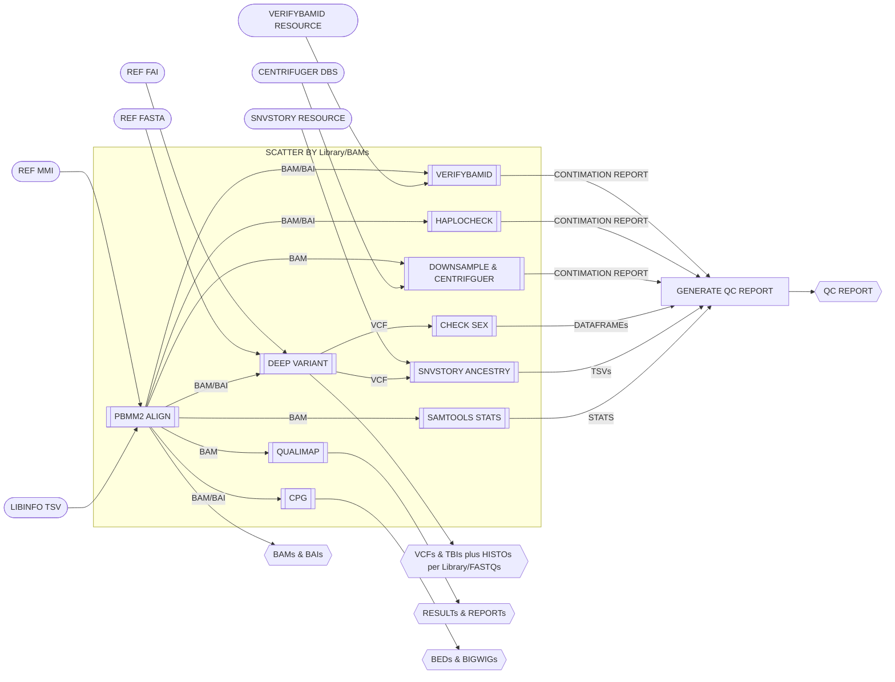

# SMaHT Long Read QC Pipeline

PacBio long read QC by aligning nad calling variants with DeepVariant. Additionally run CPG and  Qualimap. Use these VCFs to determine sex and ancestory. These results are collated into a table report.

## Pipeline Chart

## Pipeline Files
* long_read_qc.wdl - WDL pipeline
* long_read_qc.inputs.json - pipeline inputs with place holders
* long_read_qc.outputs.yaml - steps and outputs to be copied after pipeline run
* long_read_qc.doc.md - this file, documenting the pipeline

## Imports
To generate imports, use /app/scritps/build_imports in smaht-qc docker image. See main repo README for example.

## Inputs
See *long_read_qc_batch.inputs.json* file. To generate the libinfo TSV with the smaht command. See main repo README for example.

## Outputs
See *long_read_qc_batch.outputs.yaml* file.
