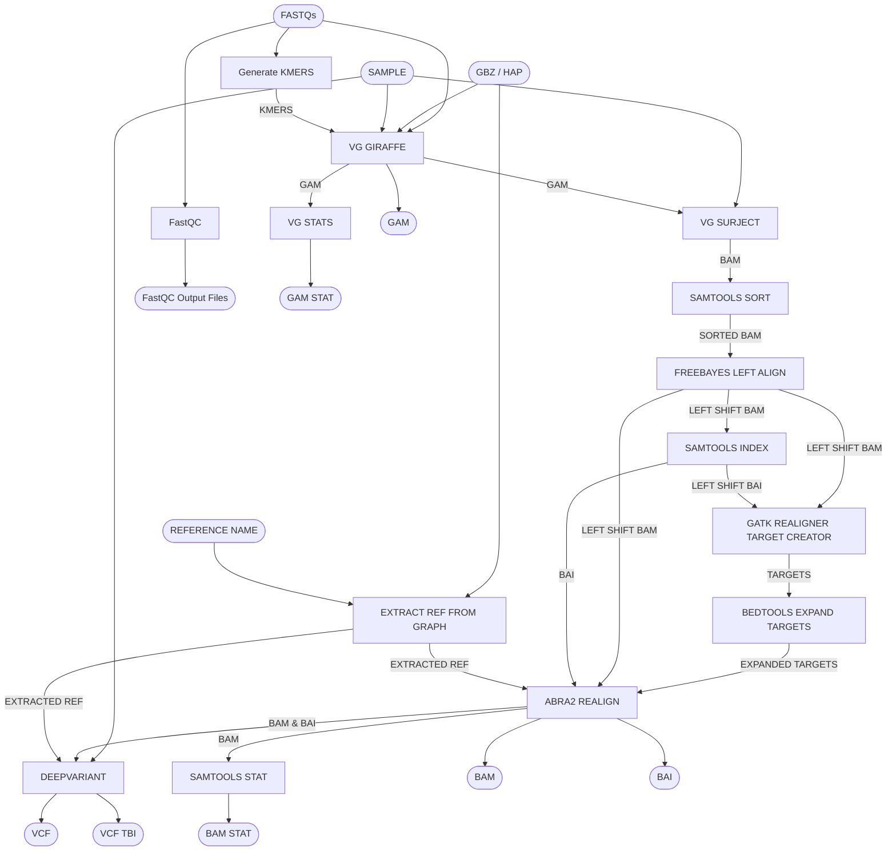

# Pangenome WGS Pipeline

Map WGS data to the pangenome graph using the "personalized pangenome method" using giraffe, polish alignemnt indels with freebayes left shift & abra2 realign indels, and call variants with haplotype caller and deep variant. Produces a GAM (w/ stats), positional sorted BAM (w/ BAI & stats), plus VCF (w/ TBI).

## Pipeline Chart

## Pipeline Files
* wgs.wdl          - WDL pipeline
* wgs.inputs.json  - pipeline inputs with place holders
* wgs.outputs.yaml - steps and outputs to be copied after pipeline run
* wgs.imports.zip  - imports used in the WDL
* wgs.doc.md       - this file, documenting the pipeline

## Inputs
See [inputs json](https://github.com/twlab/cig-pipelines/blob/main/wdl/pipelines/pangenome/wgs.inputs.json) for all inputs.

* sample [String] - sample name for outputs
* fastqs [File] - an array of read1 and read2 fastqs 
* gbz [File] - giraffe pangenome GBZ
* hap [File] - vg haplotypes for the GBZ
* reference_name [String] - reference name to extract from the graph

## Outputs
See [inputs json](https://github.com/twlab/cig-pipelines/blob/main/wdl/pipelines/pangenome/wgs.outputs.yaml).
